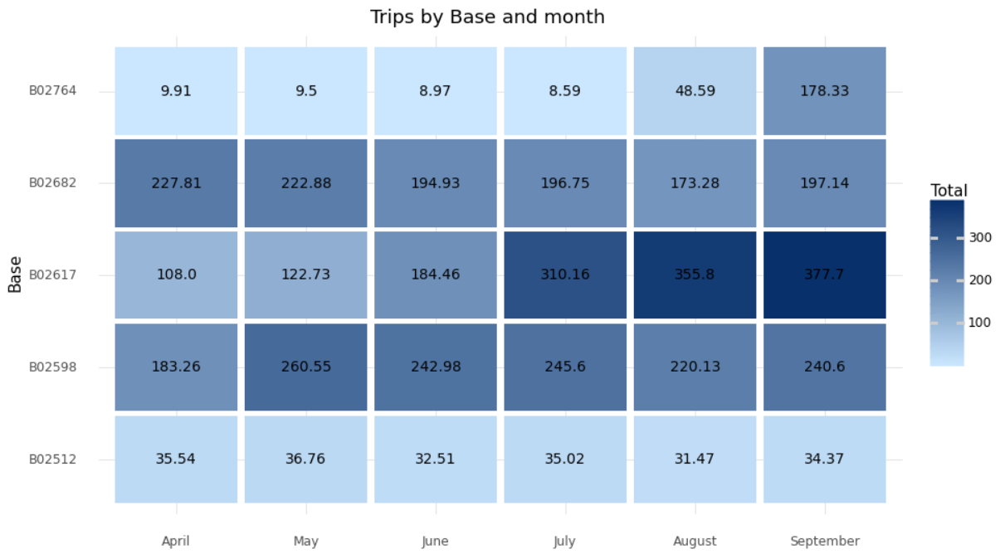

# Uber dataset analysis

This project's goal is to analyze data about Uber rides while using various data visualization frameworks that are available for Python. Data on Uber rides in New York from April to September of 2014 are included in the dataset. The information was gathered by FiveThirtyEight and is accessible on [Kaggle](https://www.kaggle.com/datasets/fivethirtyeight/uber-pickups-in-new-york-city?select=uber-raw-data-aug14.csv).

The variables in the dataset are:

| name | descripiton |
| -- | -- |
| Date/Time | The date and hour of Uber pickup |
| Lat | The Latitude of the Uber pickup |
| Lon | The longitude of the Uber pickup |
| Base | The LTC base company code affiliated with the Uber pickup |

# Loading the data


```python
import pandas as pd 

apr_data = pd.read_csv('./data/uber-raw-data-apr14.csv') # Pickups in april
may_data = pd.read_csv('./data/uber-raw-data-may14.csv') # Pickups in may
jun_data = pd.read_csv('./data/uber-raw-data-jun14.csv') # pickups in june
jul_data = pd.read_csv('./data/uber-raw-data-jul14.csv') # pickups in july
aug_data = pd.read_csv('./data/uber-raw-data-aug14.csv') # pickups in august
sep_data = pd.read_csv('./data/uber-raw-data-sep14.csv') # pickups in september

# Concat all the subsets in just one variable
data = pd.concat([apr_data, may_data, jun_data, jul_data, aug_data, sep_data])

del apr_data, may_data, jun_data, jul_data, aug_data, sep_data # Deleting the unnecessary variables to clean the memory

data['Date/Time'] = pd.to_datetime(data['Date/Time'], format='%m/%d/%Y %H:%M:%S') # String to datetime
data['day'] = data['Date/Time'].dt.day # Extract the day
data['month'] = data['Date/Time'].dt.month # Extract the month
data['year'] = data['Date/Time'].dt.year # Extract the year
data['day_of_week'] = data['Date/Time'].dt.day_of_week # Extract the day of the week
data['hour'] = data['Date/Time'].dt.hour # Extract the hour
data['minute'] = data['Date/Time'].dt.minute # Extract the minute
data['second'] = data['Date/Time'].dt.second # Extract the second

data.head()
```


<div>
<style scoped>
    .dataframe tbody tr th:only-of-type {
        vertical-align: middle;
    }

    .dataframe tbody tr th {
        vertical-align: top;
    }

    .dataframe thead th {
        text-align: right;
    }
</style>
<table border="1" class="dataframe">
  <thead>
    <tr style="text-align: right;">
      <th></th>
      <th>Date/Time</th>
      <th>Lat</th>
      <th>Lon</th>
      <th>Base</th>
      <th>day</th>
      <th>month</th>
      <th>year</th>
      <th>day_of_week</th>
      <th>hour</th>
      <th>minute</th>
      <th>second</th>
    </tr>
  </thead>
  <tbody>
    <tr>
      <th>0</th>
      <td>2014-04-01 00:11:00</td>
      <td>40.7690</td>
      <td>-73.9549</td>
      <td>B02512</td>
      <td>1</td>
      <td>4</td>
      <td>2014</td>
      <td>1</td>
      <td>0</td>
      <td>11</td>
      <td>0</td>
    </tr>
    <tr>
      <th>1</th>
      <td>2014-04-01 00:17:00</td>
      <td>40.7267</td>
      <td>-74.0345</td>
      <td>B02512</td>
      <td>1</td>
      <td>4</td>
      <td>2014</td>
      <td>1</td>
      <td>0</td>
      <td>17</td>
      <td>0</td>
    </tr>
    <tr>
      <th>2</th>
      <td>2014-04-01 00:21:00</td>
      <td>40.7316</td>
      <td>-73.9873</td>
      <td>B02512</td>
      <td>1</td>
      <td>4</td>
      <td>2014</td>
      <td>1</td>
      <td>0</td>
      <td>21</td>
      <td>0</td>
    </tr>
    <tr>
      <th>3</th>
      <td>2014-04-01 00:28:00</td>
      <td>40.7588</td>
      <td>-73.9776</td>
      <td>B02512</td>
      <td>1</td>
      <td>4</td>
      <td>2014</td>
      <td>1</td>
      <td>0</td>
      <td>28</td>
      <td>0</td>
    </tr>
    <tr>
      <th>4</th>
      <td>2014-04-01 00:33:00</td>
      <td>40.7594</td>
      <td>-73.9722</td>
      <td>B02512</td>
      <td>1</td>
      <td>4</td>
      <td>2014</td>
      <td>1</td>
      <td>0</td>
      <td>33</td>
      <td>0</td>
    </tr>
  </tbody>
</table>
</div>


```python
days_names = {0:'Monday', 1:'Tuesday', 2:'Wednesday', 3:'Thursday', 4:'Friday', 5:'Saturday', 6:'Sunday'}
months_names = {4:'April', 5:'May', 6:'June', 7:'July', 8:'August', 9:'September'}
```

# Trips by the hours in a day


```python
hour_data = data.groupby('hour')['hour'].count().to_frame().rename(columns={'hour':'Total'})
```


```python
import matplotlib.pyplot as plt

fig, ax = plt.subplots(figsize=(11, 6), dpi=100)
fig.fontsize = 20
ax.plot(hour_data, color='#09091a')
ax.set_xlim(0, 23)
ax.set_xticks(range(24))
ax.set_ylim(0, hour_data.Total.max() + 5000)
ax.spines[['top', 'right']].set_visible(False)
ax.set_xlabel('Hour', fontsize=14, color='#222233')
plt.suptitle('Number of trips during the day', fontsize=18, color='#09091a',
             x=0.123, y=1.05, ha='left')
ax.set_title('Most trips in 2014 took place after 15:00', 
             fontsize=14, loc='left', color='#1fbad6', y=1.1, ha='left')

ax.vlines(15, ymin=0, ymax=hour_data.Total.max(), color='#c0c0c8')
ax.text(15.3, hour_data.loc[15] / 1.2, '2,521,360 trips \nwere recorded between\n 15:00 and 23:00 hours.', color='#222233')
ax.text(14.8, hour_data.loc[15] / 3, '2,288,433 trips \nwere recorded between\n 00:00 and 15:00.',
        horizontalalignment='right', color='#222233')
ax.plot(17, hour_data.loc[17], 'o', color='#222233')
ax.text(17, hour_data.loc[17] * 1.02, 'Pickups peak at 17:00 with 336,190 trips.')
plt.show()
```


    

    


# Trips by hour and month


```python
data_hour_month = pd.crosstab(data.hour, data.month)
data_hour_month = data_hour_month.rename(columns=months_names)
data_hour_month
```


<div>
<style scoped>
    .dataframe tbody tr th:only-of-type {
        vertical-align: middle;
    }

    .dataframe tbody tr th {
        vertical-align: top;
    }

    .dataframe thead th {
        text-align: right;
    }
</style>
<table border="1" class="dataframe">
  <thead>
    <tr style="text-align: right;">
      <th>month</th>
      <th>April</th>
      <th>May</th>
      <th>June</th>
      <th>July</th>
      <th>August</th>
      <th>September</th>
    </tr>
    <tr>
      <th>hour</th>
      <th></th>
      <th></th>
      <th></th>
      <th></th>
      <th></th>
      <th></th>
    </tr>
  </thead>
  <tbody>
    <tr>
      <th>0</th>
      <td>11910</td>
      <td>13875</td>
      <td>14514</td>
      <td>17953</td>
      <td>21451</td>
      <td>24133</td>
    </tr>
    <tr>
      <th>1</th>
      <td>7769</td>
      <td>8186</td>
      <td>9167</td>
      <td>11527</td>
      <td>14471</td>
      <td>16107</td>
    </tr>
    <tr>
      <th>2</th>
      <td>4935</td>
      <td>5372</td>
      <td>6189</td>
      <td>8562</td>
      <td>10105</td>
      <td>10702</td>
    </tr>
    <tr>
      <th>3</th>
      <td>5040</td>
      <td>5946</td>
      <td>6937</td>
      <td>9199</td>
      <td>10376</td>
      <td>10789</td>
    </tr>
    <tr>
      <th>4</th>
      <td>6095</td>
      <td>6945</td>
      <td>7701</td>
      <td>10040</td>
      <td>11774</td>
      <td>12675</td>
    </tr>
    <tr>
      <th>5</th>
      <td>9476</td>
      <td>10789</td>
      <td>11955</td>
      <td>14932</td>
      <td>16525</td>
      <td>20262</td>
    </tr>
    <tr>
      <th>6</th>
      <td>18498</td>
      <td>21015</td>
      <td>22030</td>
      <td>23456</td>
      <td>24907</td>
      <td>33307</td>
    </tr>
    <tr>
      <th>7</th>
      <td>24924</td>
      <td>27413</td>
      <td>30834</td>
      <td>32545</td>
      <td>34064</td>
      <td>43314</td>
    </tr>
    <tr>
      <th>8</th>
      <td>22843</td>
      <td>25460</td>
      <td>29771</td>
      <td>33387</td>
      <td>34566</td>
      <td>44477</td>
    </tr>
    <tr>
      <th>9</th>
      <td>17939</td>
      <td>20507</td>
      <td>24298</td>
      <td>28486</td>
      <td>30195</td>
      <td>38542</td>
    </tr>
    <tr>
      <th>10</th>
      <td>17865</td>
      <td>20801</td>
      <td>23584</td>
      <td>28558</td>
      <td>30706</td>
      <td>37634</td>
    </tr>
    <tr>
      <th>11</th>
      <td>18774</td>
      <td>22055</td>
      <td>24155</td>
      <td>30120</td>
      <td>31778</td>
      <td>38821</td>
    </tr>
    <tr>
      <th>12</th>
      <td>19425</td>
      <td>23595</td>
      <td>25233</td>
      <td>30900</td>
      <td>32106</td>
      <td>39193</td>
    </tr>
    <tr>
      <th>13</th>
      <td>22603</td>
      <td>27699</td>
      <td>28937</td>
      <td>35832</td>
      <td>35764</td>
      <td>45042</td>
    </tr>
    <tr>
      <th>14</th>
      <td>27190</td>
      <td>34363</td>
      <td>34428</td>
      <td>41357</td>
      <td>40644</td>
      <td>52643</td>
    </tr>
    <tr>
      <th>15</th>
      <td>35324</td>
      <td>43087</td>
      <td>41586</td>
      <td>46053</td>
      <td>48197</td>
      <td>61219</td>
    </tr>
    <tr>
      <th>16</th>
      <td>42003</td>
      <td>49127</td>
      <td>48162</td>
      <td>52403</td>
      <td>53481</td>
      <td>68224</td>
    </tr>
    <tr>
      <th>17</th>
      <td>45475</td>
      <td>51508</td>
      <td>50452</td>
      <td>58260</td>
      <td>57122</td>
      <td>73373</td>
    </tr>
    <tr>
      <th>18</th>
      <td>43003</td>
      <td>48965</td>
      <td>45013</td>
      <td>57268</td>
      <td>55390</td>
      <td>75040</td>
    </tr>
    <tr>
      <th>19</th>
      <td>38923</td>
      <td>42387</td>
      <td>38203</td>
      <td>52332</td>
      <td>53008</td>
      <td>69660</td>
    </tr>
    <tr>
      <th>20</th>
      <td>36244</td>
      <td>40731</td>
      <td>40108</td>
      <td>51859</td>
      <td>51674</td>
      <td>63988</td>
    </tr>
    <tr>
      <th>21</th>
      <td>36964</td>
      <td>42217</td>
      <td>40791</td>
      <td>49528</td>
      <td>51354</td>
      <td>60606</td>
    </tr>
    <tr>
      <th>22</th>
      <td>30645</td>
      <td>35556</td>
      <td>35614</td>
      <td>42218</td>
      <td>46008</td>
      <td>51817</td>
    </tr>
    <tr>
      <th>23</th>
      <td>20649</td>
      <td>24836</td>
      <td>24182</td>
      <td>29346</td>
      <td>33609</td>
      <td>36568</td>
    </tr>
  </tbody>
</table>
</div>


```python
fig, ax = plt.subplots(figsize=(11, 6), dpi=100)
data_hour_month.plot(kind='bar', stacked=True, color=['#d9d9d9', '#999999', '#747474', '#5d5d5d', '#3f3f3f', '#1fbad6'], ax=ax)
ax.spines[['top', 'right']].set_visible(False)
ax.set_xlabel('Hour', fontsize=14, color='#222233')
plt.legend(title='Month')
plt.suptitle('Number of trips by month and hour', fontsize=18, color='#09091a',
             x=0.123, y=1.05, ha='left')
ax.set_title('In the month of September, more trips were registered', 
             fontsize=14, loc='left', color='#1fbad6', y=1.1, ha='left')
ax.text(17, hour_data.loc[17], 'Peak hours are \nthe same every month.',
        horizontalalignment='right', color='#222233')
plt.show()
```


    

    


# Trips by day and month


```python
trips_avg = round(data.day.value_counts().mean(), 0)
daily_trips = data.day.value_counts()
days_above_avg = daily_trips[daily_trips > trips_avg].to_frame().sort_index()
```


```python
palette = []

for i in range(32):
    if i == 29:
        palette.append('#1fbad6')
    elif i == 30:
        palette.append('#d9d9d9')
    elif i+1 in days_above_avg.index:
        palette.append('#3f3f3f')
    else:
        palette.append('#999999')
```


```python
import seaborn as sns
import matplotlib.pyplot as plt

sns.set(rc={'figure.figsize':(10, 6),
            'axes.facecolor':'white',
            'figure.facecolor':'white'})
ax = sns.countplot(data=data, x='day', palette=palette)
ax.set_xlabel('Hour', fontsize=12)
ax.set_ylabel('')
plt.suptitle('Number of trips by day and month', fontsize=18, color='#09091a',
             x=0.123, y=1.05, ha='left')
ax.set_title('17 out of 31 days are above average trips.', 
             fontsize=14, loc='left', color='#1fbad6', y=1.1, ha='left')
ax.hlines(trips_avg, xmin=-0.5, xmax=31, ls='--', colors='k')
ax.text(31, trips_avg, f"Average = {int(trips_avg)}", va='center')
ax.text(30, daily_trips.loc[31], f"{daily_trips.loc[31]} trips")
ax.text(29, daily_trips.loc[30], f"{daily_trips.loc[30]} trips", color='#1fbad6', weight='bold')
ax;
```


    

    


# Trips by week day and month


```python
data2 = data.copy()
data2 = data2.replace({'month': months_names, 'day_of_week': days_names})
```


```python
import plotly.express as px

palette = ['#0d47a1', '#1565c0', '#1976d2', '#1e88e5', '#2196f3', '#42a5f5', '#64b5f6', '#90caf9']

px.histogram(data2, x='month', color='day_of_week', barmode='group',
             labels = {'month':'Months', 'day_of_week':'Day of week'},
             title = 'Trips by week day and month',
             color_discrete_sequence = palette,
             category_orders = {'day_of_week': ['Monday', 'Tuesday', 'Wednesday', 'Quinta', 'Thursday', 'Saturday', 'Sunday']}
             ).update_layout(yaxis_title = '',
                             plot_bgcolor = 'rgb(255, 255, 255)')
```


# Trips by month


```python
from plotnine import ggplot
from plotnine import *
import plotnine as p9

trips = data.groupby('month')['month'].count().to_frame().rename(columns={'month':'Total'}).reset_index()
palette = ('#2d9dff', '#2d9dff', '#2d9dff', '#2d9dff', '#2d9dff', '#2d9dff')

p9.options.figure_size = (10, 6)

ggplot(trips)\
    + aes(x='month', y='Total', fill='factor(month)')\
    + geom_col()\
    + coord_flip()\
    + geom_text(
        aes(label = 'Total'),
        ha = 'right'
    )\
    + labs(
        y = 'Trips',
        x = 'Months'  ,
        title = 'Trips by month'     
    )\
    + theme_minimal()\
    + theme(legend_position='none')\
    + scale_x_continuous(breaks=list(range(4, 10)), labels=['April', 'May', 'June', 'July', 'August', 'September'])\
    + scale_fill_manual(values=palette)
```


    

    


    <ggplot: (167300155338)>


# Trips by Base


```python
base_trips = data.groupby('Base')['Base'].count().to_frame().rename(columns={'Base':'Total'}).reset_index()
base_trips
```


<div>
<style scoped>
    .dataframe tbody tr th:only-of-type {
        vertical-align: middle;
    }

    .dataframe tbody tr th {
        vertical-align: top;
    }

    .dataframe thead th {
        text-align: right;
    }
</style>
<table border="1" class="dataframe">
  <thead>
    <tr style="text-align: right;">
      <th></th>
      <th>Base</th>
      <th>Total</th>
    </tr>
  </thead>
  <tbody>
    <tr>
      <th>0</th>
      <td>B02512</td>
      <td>205673</td>
    </tr>
    <tr>
      <th>1</th>
      <td>B02598</td>
      <td>1393113</td>
    </tr>
    <tr>
      <th>2</th>
      <td>B02617</td>
      <td>1458853</td>
    </tr>
    <tr>
      <th>3</th>
      <td>B02682</td>
      <td>1212789</td>
    </tr>
    <tr>
      <th>4</th>
      <td>B02764</td>
      <td>263899</td>
    </tr>
  </tbody>
</table>
</div>


```python
import altair as alt

bars = alt.Chart(base_trips, title='Trips by Base').mark_bar().encode(
    x='Total',
    y="Base"
)

text = bars.mark_text(
    align='right',
    baseline='middle',
    dx=-3, color='#ffffff'
).encode(
    text='Total'
)

(bars + text).properties(height=200)
```


<div id="altair-viz-1f52d78bce504098b54c5b076cfb0d57"></div>
<script type="text/javascript">
  var VEGA_DEBUG = (typeof VEGA_DEBUG == "undefined") ? {} : VEGA_DEBUG;
  (function(spec, embedOpt){
    let outputDiv = document.currentScript.previousElementSibling;
    if (outputDiv.id !== "altair-viz-1f52d78bce504098b54c5b076cfb0d57") {
      outputDiv = document.getElementById("altair-viz-1f52d78bce504098b54c5b076cfb0d57");
    }
    const paths = {
      "vega": "https://cdn.jsdelivr.net/npm//vega@5?noext",
      "vega-lib": "https://cdn.jsdelivr.net/npm//vega-lib?noext",
      "vega-lite": "https://cdn.jsdelivr.net/npm//vega-lite@4.17.0?noext",
      "vega-embed": "https://cdn.jsdelivr.net/npm//vega-embed@6?noext",
    };

    function maybeLoadScript(lib, version) {
      var key = `${lib.replace("-", "")}_version`;
      return (VEGA_DEBUG[key] == version) ?
        Promise.resolve(paths[lib]) :
        new Promise(function(resolve, reject) {
          var s = document.createElement('script');
          document.getElementsByTagName("head")[0].appendChild(s);
          s.async = true;
          s.onload = () => {
            VEGA_DEBUG[key] = version;
            return resolve(paths[lib]);
          };
          s.onerror = () => reject(`Error loading script: ${paths[lib]}`);
          s.src = paths[lib];
        });
    }

    function showError(err) {
      outputDiv.innerHTML = `<div class="error" style="color:red;">${err}</div>`;
      throw err;
    }

    function displayChart(vegaEmbed) {
      vegaEmbed(outputDiv, spec, embedOpt)
        .catch(err => showError(`Javascript Error: ${err.message}<br>This usually means there's a typo in your chart specification. See the javascript console for the full traceback.`));
    }

    if(typeof define === "function" && define.amd) {
      requirejs.config({paths});
      require(["vega-embed"], displayChart, err => showError(`Error loading script: ${err.message}`));
    } else {
      maybeLoadScript("vega", "5")
        .then(() => maybeLoadScript("vega-lite", "4.17.0"))
        .then(() => maybeLoadScript("vega-embed", "6"))
        .catch(showError)
        .then(() => displayChart(vegaEmbed));
    }
  })({"config": {"view": {"continuousWidth": 400, "continuousHeight": 300}}, "layer": [{"mark": "bar", "encoding": {"x": {"field": "Total", "type": "quantitative"}, "y": {"field": "Base", "type": "nominal"}}, "title": "Trips by Base"}, {"mark": {"type": "text", "align": "right", "baseline": "middle", "color": "#ffffff", "dx": -3}, "encoding": {"text": {"field": "Total", "type": "quantitative"}, "x": {"field": "Total", "type": "quantitative"}, "y": {"field": "Base", "type": "nominal"}}, "title": "Trips by Base"}], "data": {"name": "data-59aa53d7da98bd5cca9186caa85ba85f"}, "height": 200, "$schema": "https://vega.github.io/schema/vega-lite/v4.17.0.json", "datasets": {"data-59aa53d7da98bd5cca9186caa85ba85f": [{"Base": "B02512", "Total": 205673}, {"Base": "B02598", "Total": 1393113}, {"Base": "B02617", "Total": 1458853}, {"Base": "B02682", "Total": 1212789}, {"Base": "B02764", "Total": 263899}]}}, {"mode": "vega-lite"});
</script>


# Trips by base and month


```python
month_base_trips = pd.crosstab(data.Base, data.month)
month_base_trips = month_base_trips.rename(columns=months_names)
month_base_trips
```


<div>
<style scoped>
    .dataframe tbody tr th:only-of-type {
        vertical-align: middle;
    }

    .dataframe tbody tr th {
        vertical-align: top;
    }

    .dataframe thead th {
        text-align: right;
    }
</style>
<table border="1" class="dataframe">
  <thead>
    <tr style="text-align: right;">
      <th>month</th>
      <th>April</th>
      <th>May</th>
      <th>June</th>
      <th>July</th>
      <th>August</th>
      <th>September</th>
    </tr>
    <tr>
      <th>Base</th>
      <th></th>
      <th></th>
      <th></th>
      <th></th>
      <th></th>
      <th></th>
    </tr>
  </thead>
  <tbody>
    <tr>
      <th>B02512</th>
      <td>35536</td>
      <td>36765</td>
      <td>32509</td>
      <td>35021</td>
      <td>31472</td>
      <td>34370</td>
    </tr>
    <tr>
      <th>B02598</th>
      <td>183263</td>
      <td>260549</td>
      <td>242975</td>
      <td>245597</td>
      <td>220129</td>
      <td>240600</td>
    </tr>
    <tr>
      <th>B02617</th>
      <td>108001</td>
      <td>122734</td>
      <td>184460</td>
      <td>310160</td>
      <td>355803</td>
      <td>377695</td>
    </tr>
    <tr>
      <th>B02682</th>
      <td>227808</td>
      <td>222883</td>
      <td>194926</td>
      <td>196754</td>
      <td>173280</td>
      <td>197138</td>
    </tr>
    <tr>
      <th>B02764</th>
      <td>9908</td>
      <td>9504</td>
      <td>8974</td>
      <td>8589</td>
      <td>48591</td>
      <td>178333</td>
    </tr>
  </tbody>
</table>
</div>


```python
from bokeh.io import show
from bokeh.models import ColumnDataSource, FactorRange
from bokeh.plotting import figure

x = [(base, mes) for base in month_base_trips.index.values[:] for mes in month_base_trips.columns]
counts = [month_base_trips.loc[base, mes] for base in month_base_trips.index.values[:] for mes in month_base_trips.columns]
source = ColumnDataSource(data=dict(x=x, counts=counts))

p = figure(x_range=FactorRange(*x), plot_height=350, title="Trips by base and month",
           toolbar_location=None, tools="")

p.vbar(x='x', top='counts', width=0.9, source=source)

p.y_range.start = 0
p.x_range.range_padding = 0.1
p.xaxis.major_label_orientation = 1
p.xgrid.grid_line_color = None
show(p)

```


# Trips by Base and day of week


```python
data2 = data.copy()
data2 = data2.replace({'month': months_names, 'day_of_week': days_names})
base_days_week_trips = pd.crosstab(data2.Base, data2.day_of_week)
base_days_week_trips
```


<div>
<style scoped>
    .dataframe tbody tr th:only-of-type {
        vertical-align: middle;
    }

    .dataframe tbody tr th {
        vertical-align: top;
    }

    .dataframe thead th {
        text-align: right;
    }
</style>
<table border="1" class="dataframe">
  <thead>
    <tr style="text-align: right;">
      <th>day_of_week</th>
      <th>Friday</th>
      <th>Monday</th>
      <th>Saturday</th>
      <th>Sunday</th>
      <th>Thursday</th>
      <th>Tuesday</th>
      <th>Wednesday</th>
    </tr>
    <tr>
      <th>Base</th>
      <th></th>
      <th></th>
      <th></th>
      <th></th>
      <th></th>
      <th></th>
      <th></th>
    </tr>
  </thead>
  <tbody>
    <tr>
      <th>B02512</th>
      <td>33319</td>
      <td>25460</td>
      <td>26773</td>
      <td>20490</td>
      <td>35032</td>
      <td>31670</td>
      <td>32929</td>
    </tr>
    <tr>
      <th>B02598</th>
      <td>229908</td>
      <td>163542</td>
      <td>198832</td>
      <td>146652</td>
      <td>235157</td>
      <td>202378</td>
      <td>216644</td>
    </tr>
    <tr>
      <th>B02617</th>
      <td>234379</td>
      <td>176416</td>
      <td>206554</td>
      <td>164452</td>
      <td>240216</td>
      <td>214167</td>
      <td>222669</td>
    </tr>
    <tr>
      <th>B02682</th>
      <td>201594</td>
      <td>143372</td>
      <td>170160</td>
      <td>126511</td>
      <td>205091</td>
      <td>176198</td>
      <td>189863</td>
    </tr>
    <tr>
      <th>B02764</th>
      <td>41939</td>
      <td>32682</td>
      <td>43795</td>
      <td>32075</td>
      <td>39649</td>
      <td>39376</td>
      <td>34383</td>
    </tr>
  </tbody>
</table>
</div>


```python
import pygal
from pygal.style import LightenStyle
dark_lighten_style = LightenStyle('#336676')

bar_chart = pygal.Bar(style=dark_lighten_style, height=250)
bar_chart.title = 'Trips by Base and day of week'
bar_chart.x_labels = base_days_week_trips.index.values[:]
for column in ['Monday', 'Tuesday', 'Wednesday', 'Thursday', 'Friday', 'Saturday', 'Sunday']:
    bar_chart.add(column, base_days_week_trips[column])
bar_chart.render_to_file('trips_base_week_day.svg')

```


# Heatmaps

## Heatmap: trips by hour and day


```python
trips = pd.crosstab(data.hour, data.day) / 1_000
```


```python
import matplotlib.pyplot as plt
import numpy as np

fig, ax = plt.subplots(figsize=(10, 10))
im = ax.imshow(trips, cmap=plt.get_cmap("Blues", 13), vmin=0, vmax=13)

ax.set_xticks(np.arange(len(trips.columns)), labels=trips.columns, fontsize=10)
ax.set_yticks(np.arange(len(trips.index)), labels=trips.index, fontsize=10)
ax.set_title("Trips by hour and day", fontsize=20)

cbar = ax.figure.colorbar(im, ticks=np.arange(14), fraction=0.035, ax=ax)
cbar.ax.set_ylabel("Trips in thounsands", rotation=-90, va="bottom", fontsize=12)

ax.spines[:].set_visible(False)

ax.set_xticks(np.arange(trips.shape[1]+1)-.5, minor=True)
ax.set_yticks(np.arange(trips.shape[0]+1)-.5, minor=True)
ax.grid(which="minor", color="w", linestyle='-', linewidth=3)
ax.tick_params(which="minor", bottom=False, left=False)

ax.set_xlabel('Day', fontsize=12)
ax.set_ylabel('Hour', fontsize=12)

plt.show()
```


## Heatmap: Trips by month and day


```python
import seaborn as sns

trips = pd.crosstab(data.month, data.day) / 1_000
corridas_plot = trips.rename(index=months_names)

fig, ax = plt.subplots(figsize=(20, 7))
sns.heatmap(trips, 
            vmin=0, 
            vmax=45, 
            cmap=plt.get_cmap("Blues", 9), 
            ax=ax, 
            linewidths=2)
ax.set_title('Trips by month and day', fontsize=20)
ax.set_xlabel('Day', fontsize=12)
ax.set_ylabel('', fontsize=12)
ax.collections[0].colorbar.set_label('Trips in thousands', fontsize=12)
```


    

    


## Heatmap: Trips by month and week day


```python
trips = pd.crosstab(data.month, data.day_of_week) / 1_000
trips = trips.rename(index=months_names, columns=days_names)
```


```python
import plotly.graph_objs as go

plot = go.Heatmap(z = trips.values[:],
                  x = trips.columns,
                  y = trips.index,
                  colorscale = 'Blues',
                  xgap = 2,
                  ygap = 2,
                  zmin = 0,
                  zmax = 165,
                  colorbar = dict(title='Trips in thousands')
                )

layout = go.Layout(title = 'Trips by month and week day')

fig = go.Figure(data=plot, layout=layout)
fig.show()
```


## Heatmap: Trips by Base and month


```python
trips = data.groupby(['Base', 'month'])['hour'].count().reset_index().rename(columns={'hour':'Total'})
trips = trips.replace({'month':months_names})
trips['Total'] /= 1000
trips['Total'] = trips['Total'].round(2)
```


```python
from plotnine import *
import plotnine as p9

p9.options.figure_size = (10, 6)

ggplot(trips)\
    + aes(x='month', y='Base', fill='Total')\
    + geom_tile(aes(width=.95, height=.95))\
    + geom_text(aes(label='Total'), size=10)\
    + labs(
        y = 'Base',
        x = ''  ,
        title = 'Trips by Base and month'     
    )\
    + theme_minimal()\
    + scale_fill_gradient(low='#cbe7ff', high='#08306b')\
    + scale_x_discrete(limits=('April', 'May', 'June', 'July', 'August', 'September'))
```


    

    


    <ggplot: (167257035978)>


## Heatmap: Trips by base and week day


```python
trips = data.groupby(['Base', 'day_of_week'])['hour'].count().reset_index().rename(columns={'hour':'Total'})
trips = trips.replace({'day_of_week':days_names})
trips['Total'] /= 1000
trips['Total'] = trips['Total'].round(2)
trips.head()
```


<div>
<style scoped>
    .dataframe tbody tr th:only-of-type {
        vertical-align: middle;
    }

    .dataframe tbody tr th {
        vertical-align: top;
    }

    .dataframe thead th {
        text-align: right;
    }
</style>
<table border="1" class="dataframe">
  <thead>
    <tr style="text-align: right;">
      <th></th>
      <th>Base</th>
      <th>day_of_week</th>
      <th>Total</th>
    </tr>
  </thead>
  <tbody>
    <tr>
      <th>0</th>
      <td>B02512</td>
      <td>Monday</td>
      <td>25.46</td>
    </tr>
    <tr>
      <th>1</th>
      <td>B02512</td>
      <td>Tuesday</td>
      <td>31.67</td>
    </tr>
    <tr>
      <th>2</th>
      <td>B02512</td>
      <td>Wednesday</td>
      <td>32.93</td>
    </tr>
    <tr>
      <th>3</th>
      <td>B02512</td>
      <td>Thursday</td>
      <td>35.03</td>
    </tr>
    <tr>
      <th>4</th>
      <td>B02512</td>
      <td>Friday</td>
      <td>33.32</td>
    </tr>
  </tbody>
</table>
</div>


```python
import altair as alt

alt.Chart(trips, title='Trips by Base and week day').mark_rect().encode(
    x=alt.X('day_of_week', axis=alt.Axis(title='Week day'), sort=['Monday', 'Tuesday', 'Wednesday', 'Thursday',
                                                                  'Friday', 'Saturday', 'Sunday']),
    y='Base',
    color=alt.Color('Total', scale=alt.Scale(scheme='blues')),
).properties(height=300, width=300)
```


<div id="altair-viz-fafa97f1ba6d4b4ba064820b8e730dbc"></div>
<script type="text/javascript">
  var VEGA_DEBUG = (typeof VEGA_DEBUG == "undefined") ? {} : VEGA_DEBUG;
  (function(spec, embedOpt){
    let outputDiv = document.currentScript.previousElementSibling;
    if (outputDiv.id !== "altair-viz-fafa97f1ba6d4b4ba064820b8e730dbc") {
      outputDiv = document.getElementById("altair-viz-fafa97f1ba6d4b4ba064820b8e730dbc");
    }
    const paths = {
      "vega": "https://cdn.jsdelivr.net/npm//vega@5?noext",
      "vega-lib": "https://cdn.jsdelivr.net/npm//vega-lib?noext",
      "vega-lite": "https://cdn.jsdelivr.net/npm//vega-lite@4.17.0?noext",
      "vega-embed": "https://cdn.jsdelivr.net/npm//vega-embed@6?noext",
    };

    function maybeLoadScript(lib, version) {
      var key = `${lib.replace("-", "")}_version`;
      return (VEGA_DEBUG[key] == version) ?
        Promise.resolve(paths[lib]) :
        new Promise(function(resolve, reject) {
          var s = document.createElement('script');
          document.getElementsByTagName("head")[0].appendChild(s);
          s.async = true;
          s.onload = () => {
            VEGA_DEBUG[key] = version;
            return resolve(paths[lib]);
          };
          s.onerror = () => reject(`Error loading script: ${paths[lib]}`);
          s.src = paths[lib];
        });
    }

    function showError(err) {
      outputDiv.innerHTML = `<div class="error" style="color:red;">${err}</div>`;
      throw err;
    }

    function displayChart(vegaEmbed) {
      vegaEmbed(outputDiv, spec, embedOpt)
        .catch(err => showError(`Javascript Error: ${err.message}<br>This usually means there's a typo in your chart specification. See the javascript console for the full traceback.`));
    }

    if(typeof define === "function" && define.amd) {
      requirejs.config({paths});
      require(["vega-embed"], displayChart, err => showError(`Error loading script: ${err.message}`));
    } else {
      maybeLoadScript("vega", "5")
        .then(() => maybeLoadScript("vega-lite", "4.17.0"))
        .then(() => maybeLoadScript("vega-embed", "6"))
        .catch(showError)
        .then(() => displayChart(vegaEmbed));
    }
  })({"config": {"view": {"continuousWidth": 400, "continuousHeight": 300}}, "data": {"name": "data-fbb9d285ed803278ef34ee7d71a02aa0"}, "mark": "rect", "encoding": {"color": {"field": "Total", "scale": {"scheme": "blues"}, "type": "quantitative"}, "x": {"axis": {"title": "Week day"}, "field": "day_of_week", "sort": ["Monday", "Tuesday", "Wednesday", "Thursday", "Friday", "Saturday", "Sunday"], "type": "nominal"}, "y": {"field": "Base", "type": "nominal"}}, "height": 300, "title": "Trips by Base and week day", "width": 300, "$schema": "https://vega.github.io/schema/vega-lite/v4.17.0.json", "datasets": {"data-fbb9d285ed803278ef34ee7d71a02aa0": [{"Base": "B02512", "day_of_week": "Monday", "Total": 25.46}, {"Base": "B02512", "day_of_week": "Tuesday", "Total": 31.67}, {"Base": "B02512", "day_of_week": "Wednesday", "Total": 32.93}, {"Base": "B02512", "day_of_week": "Thursday", "Total": 35.03}, {"Base": "B02512", "day_of_week": "Friday", "Total": 33.32}, {"Base": "B02512", "day_of_week": "Saturday", "Total": 26.77}, {"Base": "B02512", "day_of_week": "Sunday", "Total": 20.49}, {"Base": "B02598", "day_of_week": "Monday", "Total": 163.54}, {"Base": "B02598", "day_of_week": "Tuesday", "Total": 202.38}, {"Base": "B02598", "day_of_week": "Wednesday", "Total": 216.64}, {"Base": "B02598", "day_of_week": "Thursday", "Total": 235.16}, {"Base": "B02598", "day_of_week": "Friday", "Total": 229.91}, {"Base": "B02598", "day_of_week": "Saturday", "Total": 198.83}, {"Base": "B02598", "day_of_week": "Sunday", "Total": 146.65}, {"Base": "B02617", "day_of_week": "Monday", "Total": 176.42}, {"Base": "B02617", "day_of_week": "Tuesday", "Total": 214.17}, {"Base": "B02617", "day_of_week": "Wednesday", "Total": 222.67}, {"Base": "B02617", "day_of_week": "Thursday", "Total": 240.22}, {"Base": "B02617", "day_of_week": "Friday", "Total": 234.38}, {"Base": "B02617", "day_of_week": "Saturday", "Total": 206.55}, {"Base": "B02617", "day_of_week": "Sunday", "Total": 164.45}, {"Base": "B02682", "day_of_week": "Monday", "Total": 143.37}, {"Base": "B02682", "day_of_week": "Tuesday", "Total": 176.2}, {"Base": "B02682", "day_of_week": "Wednesday", "Total": 189.86}, {"Base": "B02682", "day_of_week": "Thursday", "Total": 205.09}, {"Base": "B02682", "day_of_week": "Friday", "Total": 201.59}, {"Base": "B02682", "day_of_week": "Saturday", "Total": 170.16}, {"Base": "B02682", "day_of_week": "Sunday", "Total": 126.51}, {"Base": "B02764", "day_of_week": "Monday", "Total": 32.68}, {"Base": "B02764", "day_of_week": "Tuesday", "Total": 39.38}, {"Base": "B02764", "day_of_week": "Wednesday", "Total": 34.38}, {"Base": "B02764", "day_of_week": "Thursday", "Total": 39.65}, {"Base": "B02764", "day_of_week": "Friday", "Total": 41.94}, {"Base": "B02764", "day_of_week": "Saturday", "Total": 43.8}, {"Base": "B02764", "day_of_week": "Sunday", "Total": 32.08}]}}, {"mode": "vega-lite"});
</script>


# Maps of Uber rides


```python
import pandas as pd
import numpy as np

from bokeh.plotting import figure
from bokeh.tile_providers import get_provider, WIKIMEDIA
from bokeh.io import output_notebook, show
from pyproj import Proj, transform

import warnings
warnings.filterwarnings("ignore")

```


```python
inProj = Proj(init='epsg:3857')
outProj = Proj(init='epsg:4326')

lons, lats = [], []
for lon, lat in list(set(zip(data["Lon"], data["Lat"]))):
    x, y = transform(outProj, inProj, lon, lat)
    lons.append(x)
    lats.append(y)
```


```python
data_map = pd.DataFrame([])

data_map["MercatorX"] = lons
data_map["MercatorY"] = lats

data_map.head()
```


```python
wikimedia = get_provider(WIKIMEDIA)

ny_lon1, ny_lat1 = transform(outProj, inProj, -73.7, 40.58)
ny_lon2, ny_lat2 = transform(outProj, inProj, -74.15, 40.92)

p = figure(plot_width=900, plot_height=700,
           x_range=(ny_lon1, ny_lon2), y_range=(ny_lat1, ny_lat2),
           x_axis_type="mercator", y_axis_type="mercator",
           title="Uber rides in NY")

p.add_tile(wikimedia)

p.circle(x="MercatorX", y="MercatorY",
         size=2,
         fill_color="dodgerblue", line_color="dodgerblue",
         fill_alpha=0.3,
         source=data_map)

show(p)
```


# Map Uber rides by base


```python
import matplotlib.pyplot as plt
import numpy as np
import pandas as pd
from cartopy import crs as ccrs
from cartopy import feature as cfeature
```


```python
# Set the domain for defining the plot region.
latN = 40.92
latS = 40.58
lonW = -74.15
lonE = -73.7
cLat = (latN + latS)/2
cLon = (lonW + lonE )/2

base_colors = {'B02512':'red', 'B02598':'green', 'B02617':'blue', 'B02682':'yellow', 'B02764':'gray'}
bases = data.Base.unique()

proj = ccrs.LambertConformal(central_longitude=cLon, central_latitude=cLat)
res = '10m' # Coarsest and quickest to display; other options are '10m' (slowest), '50m', 1110m.
fig = plt.figure(figsize=(18, 12))
ax = plt.subplot(1 ,1, 1, projection=proj)
ax.set_extent ([lonW, lonE, latS, latN])
ax.add_feature (cfeature.OCEAN.with_scale(res))
ax.add_feature(cfeature.COASTLINE.with_scale(res))
ax.set_title ('New York Map on Uber rides during 2014 (Apr-Sep) by Base')

for base in bases:
    lat = data.query(f'Base == "{base}"').Lat
    lon = data.query(f'Base == "{base}"').Lon
    ax.scatter(lon, lat, s=9, c=base_colors[base], 
               edgecolor=None, alpha=0.75, 
               transform=ccrs.PlateCarree(), label=base)
    
plt.legend()
plt.show()
```


    

    


```python

```
